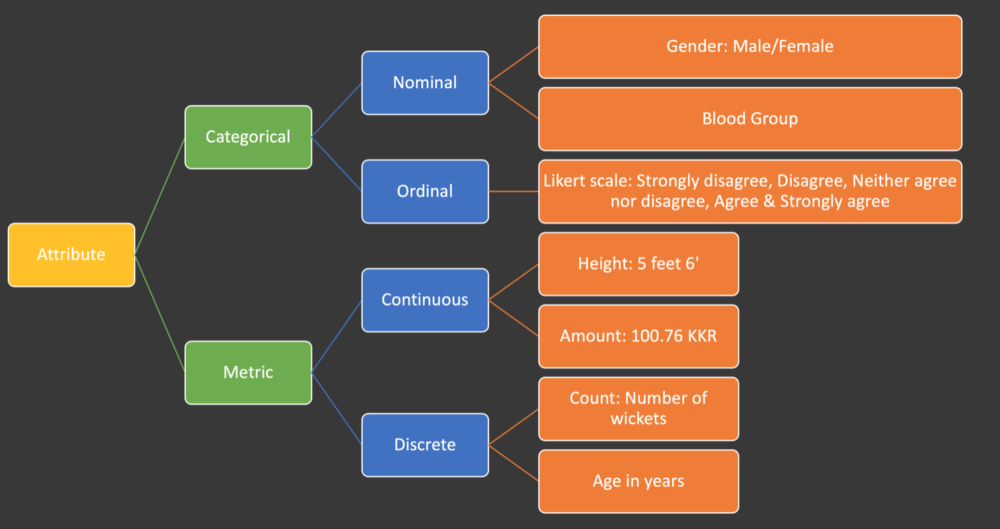
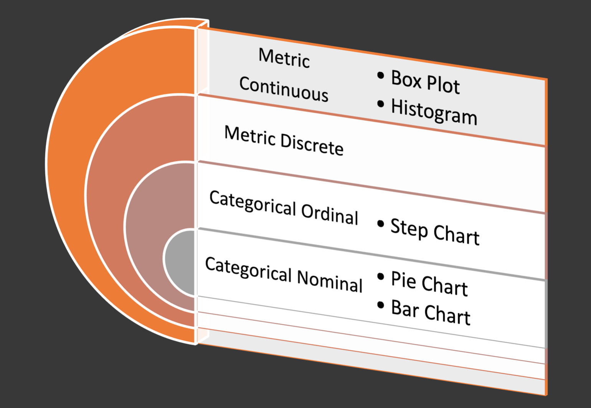

## Data Visualization
Data visualization is the process of turning data into visual forms like charts, graphs, and dashboards so humans can understand patterns, trends, and insights quickly.

There are 3 broader categories of visualization
1. Univariate Visualization
2. Bivariate Visualization
3. Multivariate Visualization

### Univariate Visualization
Univariate visualisation is about visualise single attribute. First we need to find the data type of an and then we can visualise them. 

There are 4 data types: 
1. categorical nominal
2. categorical ordinal
3. metric discrete
4. metric continoues. 

Based on the data type we can choose appropriate visualization

